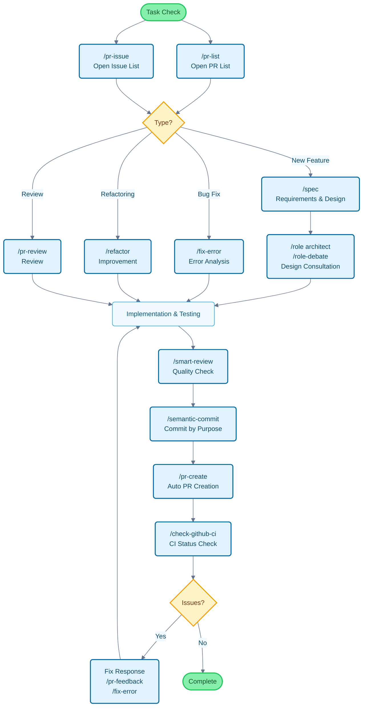

# Claude Code Cookbook

A comprehensive configuration collection to make Claude Code more convenient and powerful.

It automatically handles detailed confirmations and processes, allowing you to focus on what you really want to accomplish. Claude Code makes decisions and executes common tasks such as code fixes, test execution, and document updates.

## Key Features

Customize Claude Code's behavior with three main features:

- **Commands**: Custom commands starting with `/`
- **Roles**: Role settings for expert-perspective responses
- **Hooks**: Automatic script execution at specific timings

---

## Feature List

### Commands (Custom Commands)

Stored as Markdown files in the `/commands` directory. Execute by typing `/` followed by the filename.

| Command                   | Description                                                                                                             |
| :------------------------ | :---------------------------------------------------------------------------------------------------------------------- |
| `/analyze-dependencies` | Analyze project dependencies and visualize circular dependencies and structural issues.                                 |
| `/analyze-performance`  | Analyze application performance issues and propose improvements from a technical debt perspective.                      |
| `/check-fact`           | Verify the accuracy of given information by referencing codebase and documentation within the project.                  |
| `/check-github-ci`      | Monitor GitHub Actions CI status and track until completion.                                                            |
| `/check-prompt`         | Review current prompt content and provide improvement suggestions.                                                      |
| `/commit-message`       | Generate commit messages based on changes only.                                                                         |
| `/context7`             | Perform context management using Context7 MCP.                                                                          |
| `/design-patterns`      | Propose and review implementations based on design patterns.                                                            |
| `/explain-code`         | Explain the functionality and logic of selected code in an easy-to-understand manner.                                   |
| `/fix-error`            | Provide code fix suggestions based on error messages.                                                                   |
| `/multi-role`           | Combine multiple roles to perform parallel analysis on the same target and generate integrated reports.                 |
| `/plan`                 | Activate pre-implementation planning mode and develop detailed implementation strategies.                               |
| `/pr-auto-update`       | Automatically update Pull Request content (description, labels).                                                        |
| `/pr-create`            | Achieve efficient Pull Request workflow with automatic PR creation based on Git change analysis.                        |
| `/pr-feedback`          | Efficiently handle Pull Request review comments and achieve fundamental solutions with 3-stage error analysis approach. |
| `/pr-issue`             | Display prioritized list of open Issues in the current repository.                                                      |
| `/pr-list`              | Display prioritized list of open PRs in the current repository.                                                         |
| `/pr-review`            | Ensure code quality and architectural soundness with systematic Pull Request reviews.                                   |
| `/refactor`             | Implement safe and gradual code refactoring while evaluating SOLID principle compliance.                                |
| `/role-debate`          | Have multiple roles debate on specific themes.                                                                          |
| `/role-help`            | Display available Role list and descriptions.                                                                           |
| `/role`                 | Act as the specified role.                                                                                              |
| `/screenshot`           | Capture and analyze screen screenshots.                                                                                 |
| `/search-gemini`        | Perform web searches using Gemini.                                                                                      |
| `/semantic-commit`      | Divide large changes into meaningful minimal units and commit sequentially with semantic commit messages.               |
| `/sequential-thinking`  | Use Sequential Thinking MCP to think through complex problems step by step and reach conclusions.                       |
| `/show-plan`            | Display the current execution plan.                                                                                     |
| `/smart-review`         | Perform advanced reviews to improve code quality.                                                                       |
| `/spec`                 | Create detailed specifications that comply with Kiro's spec-driven development from requirements, step by step.         |
| `/style-ai-writting`    | Detect and correct unnatural text that appears to be AI-generated.                                                      |
| `/task`                 | Launch dedicated agents to autonomously execute complex search, investigation, and analysis tasks.                      |
| `/tech-debt`            | Analyze project technical debt and create prioritized improvement plans.                                                |
| `/ultrathink`           | Execute structured, step-by-step thinking processes for complex challenges and important decisions.                     |
| `/update-dart-doc`      | Systematically manage DartDoc comments in Dart files and maintain high-quality Japanese documentation.                  |
| `/update-doc-string`    | Uniformly manage and update documentation strings for multiple languages.                                               |
| `/update-flutter-deps`  | Safely update Flutter project dependencies.                                                                             |
| `/update-node-deps`     | Safely update Node.js project dependencies.                                                                             |
| `/update-rust-deps`     | Safely update Rust project dependencies.                                                                                |

### Roles (Role Settings)

Defined as Markdown files in the `agents/roles/` directory. Give Claude expert perspectives for more accurate responses.

Each role can also **run independently as a sub-agent**. Using the `--agent` option allows parallel execution of large-scale analysis or specialized processing without interfering with the main conversation context.

| Role                  | Description                                                                                    |
| :-------------------- | :--------------------------------------------------------------------------------------------- |
| `/role analyzer`    | Act as a system analysis expert to analyze code and architecture.                              |
| `/role architect`   | Act as a software architect to provide design reviews and proposals.                           |
| `/role frontend`    | Act as a frontend expert to provide UI/UX and performance advice.                              |
| `/role mobile`      | Act as a mobile app development expert to provide answers based on iOS/Android best practices. |
| `/role performance` | Act as a performance optimization expert to propose speed and memory usage improvements.       |
| `/role qa`          | Act as a QA engineer to review from test planning and quality assurance perspectives.          |
| `/role reviewer`    | Act as a code reviewer to evaluate code from readability and maintainability perspectives.     |
| `/role security`    | Act as a security expert to identify vulnerabilities and security risks.                       |

#### Sub-agent Execution Examples

```bash
# Normal mode (execute in main context)
/role security
"Security check for this project"

# Sub-agent mode (execute in independent context)
/role security --agent
"Execute comprehensive security audit for the entire project"

# Parallel analysis with multiple roles
/multi-role security,performance --agent
"Comprehensively analyze system security and performance"
```

### Hooks (Automation Scripts)

Configure in `settings.json` to automate development tasks.

| Execution Script                 | Event                            | Description                                                                                                              |
| :------------------------------- | :------------------------------- | :----------------------------------------------------------------------------------------------------------------------- |
| `deny-check.sh`                | `PreToolUse`                   | Prevent execution of dangerous commands like `rm -rf /`.                                                               |
| `check-ai-commit.sh`           | `PreToolUse`                   | Error when `git commit` contains AI signatures in commit messages.                                                     |
| `preserve-file-permissions.sh` | `PreToolUse` / `PostToolUse` | Save original permissions before file editing and restore after editing. Prevents Claude Code from changing permissions. |
| `ja-space-format.sh`           | `PostToolUse`                  | Automatically format spaces between Japanese and alphanumeric characters when saving files.                              |
| `auto-comment.sh`              | `PostToolUse`                  | Prompt for docstring or API documentation addition when creating new files or making major edits.                        |
| `notify-waiting`               | `Notification`                 | Notify via macOS Notification Center when Claude is waiting for user confirmation.                                       |
| `check-continue.sh`            | `Stop`                         | Check for continuable tasks upon task completion.                                                                        |
| `(osascript)`                  | `Stop`                         | Notify completion via macOS Notification Center when all tasks are completed.                                            |

---

## Development Flow and Command Usage Guide

### Command Usage Examples in Common Development Flows



---

## Setup and Customization

### Setup Instructions

1. **Clone the repository**: `git clone https://github.com/logreg-n-coffee/claude-code-cookbook.git ~/.claude`
2. **Set path in client**: Specify the above directory path in your Claude client
3. **Verify paths**: Confirm that script paths in `settings.json` match your environment

### Customization

- **Add commands**: Simply add `.md` files to `commands/`
- **Add roles**: Simply add `.md` files to `agents/roles/`
- **Edit hooks**: Modify `settings.json` to change automation processes
