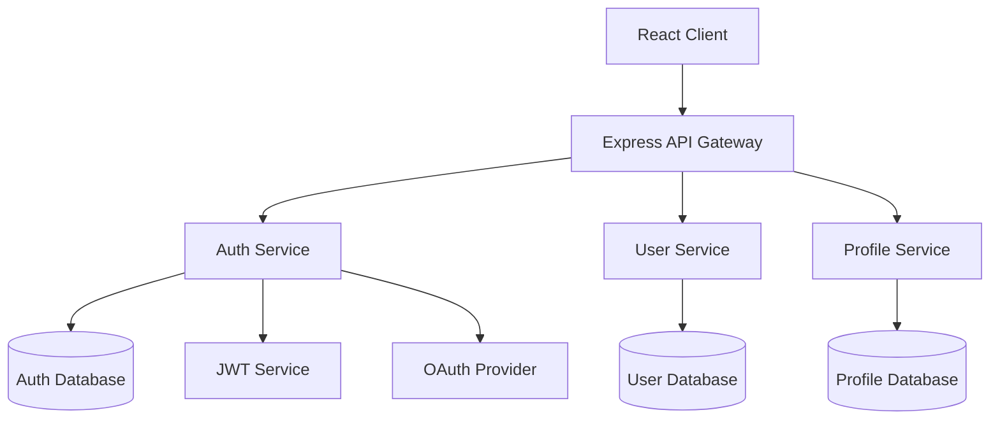

## Spec

**"Give structure before writing code"** - Complete compliance with Kiro's spec-driven development

Unlike traditional code generation tools, this realizes Kiro's specification-driven development that focuses on giving structure to development chaos. From minimal requirement input, it gradually expands from product manager-level detailed specifications to implementable designs, ensuring consistent quality from **prototype to production environment**.

### Usage

```bash
# Request Spec Mode to Claude (minimal requirement input)
"Create a spec for [feature description]"

# Kiro-style gradual expansion:
# 1. Simple requirements → Automatic detailed user story generation
# 2. Structured requirement description using EARS notation
# 3. Specification refinement through gradual dialogue
# 4. Generate 3 independent files:
#    - requirements.md: Requirement definition using EARS notation
#    - design.md: Design including Mermaid diagrams and TypeScript interfaces
#    - tasks.md: Implementation plan with automatic best practice application
```

### Proven Results (Kiro Achievements)

#### Secure File Sharing App in 2 Days

```bash
"Create spec for file sharing system (with encryption support)"
→ Production-level encrypted file sharing application completed in 2 days
→ Automatic security best practices application
→ No additional prompts required
```

#### Game Development in One Night (By Beginner)

```bash
"Create spec for 2D puzzle game"
→ Open source developer with no game development experience
→ Game creation completed in one night
→ Kiro handled implementation logic, developer focused on creativity
```

#### Weekend Prototype → Production

```bash
"Create spec for EC site product management system"
→ From concept to working prototype in one weekend
→ Consistent quality from prototype to production environment
→ Structured approach through spec-driven development
```

### Basic Examples

```bash
# Create spec for new feature (minimal input)
"Product review system
- Star rating functionality
- Comment posting
- Image upload"

# Create spec for system feature
"User authentication
- OAuth support
- Multi-factor authentication"

# Create spec for API feature
"Payment system API
- Stripe integration
- Security-focused"
```

### Integration with Claude

```bash
# Complex feature spec
"Create spec for chat functionality. Include WebSocket, real-time notifications, and history management"

# Database integration feature spec
"Create spec for EC site inventory management feature. Include product addition, stock updates, and alert functionality"

# Frontend feature spec
"Create spec for React dashboard. Include graph display, filters, and export functionality"

# Backend feature spec
"Create spec for RESTful API. Include authentication, validation, and logging"
```

### Spec Mode Characteristics

#### Gradual Interactive Workflow

- Complete reproduction of Kiro's original value of gradual discussion
- Collaborative specification refinement with users at each phase
- File generation after going through question resolution, option discussion, and approval process

#### 3-Stage Interactive Expansion

- **Phase 1**: Requirements Discovery → Discussion → Approval → `requirements.md` generation
- **Phase 2**: Design Exploration → Discussion → Approval → `design.md` generation
- **Phase 3**: Implementation Planning → Discussion → Approval → `tasks.md` generation

#### Dynamic Specification Development

- Resolve requirement ambiguities through dialogue
- Present and discuss technical options
- Explain trade-offs and confirm decisions

### Detailed Examples

```bash
# Complex system feature
"Create spec for online payment system. Include Stripe integration, security, and error handling"

# Frontend feature
"Create spec for React components. Include state management, property design, and testing"

# Backend feature
"Create spec for GraphQL API. Include schema design, resolvers, and authentication"

# DevOps feature
"Create spec for CI/CD pipeline. Include test automation, deployment, and monitoring"
```

### Gradual Interactive Workflow (Phase by Phase)

#### Phase 1: Requirements Discovery & Discussion

##### 1. Automatic Expansion from Minimal Input (Kiro Style)

```
User: "User management system
- Login functionality
- Profile editing
- Administrator privileges"

Claude: "I'll generate detailed user stories from requirements.
Is this understanding correct?

Auto-generated User Stories:
- User registration and authentication (OAuth support)
- Profile management (avatar, settings)
- Permission management (RBAC)
- Password reset functionality
- Security audit logging

I've supplemented unspecified details. Are there any other required features?"
```

##### 2. Structured Requirement Description Using EARS Notation

```
Claude: "I'll structure requirements using Kiro's EARS notation:

Requirement Definition using EARS Notation:

WHEN user attempts to log in
GIVEN correct email address and password are entered
THEN system verifies authentication
AND redirects to dashboard on success

WHILE user is on profile editing screen
THE SYSTEM SHALL execute real-time validation
AND display preview of changes

WHERE admin privileges are required for a feature
IS access is attempted
THE SYSTEM SHALL verify permission level
AND deny access if insufficient"
```

##### 3. Automatic Completion of Edge Cases & Security Requirements

```
Claude: "Based on Kiro's best practices, I've also considered the following cases:

Security Requirements (auto-completed):
- Brute force attack protection
- Session management and timeout
- CSRF protection and XSS prevention
- Password strength requirements

Edge Cases (auto-detected):
- Concurrent login limitations
- Account lock functionality
- Data integrity during migration
- Load distribution for high-volume requests

Are these requirements appropriate?"
```

##### 5. Phase 1 Completion and Approval

```
Claude: "Requirements Phase is complete.
May I generate requirements.md?"
→ "Proceed" → requirements.md generation
```

#### Phase 2: Design Exploration & Discussion

##### 1. Codebase Analysis + Automatic Design Proposal (Kiro Style)

```
Claude: "I'll analyze the existing codebase and propose optimal architecture:

Codebase Analysis Results:
- Authentication: JWT + Express.js (v4.18.x)
- Database: PostgreSQL (v14+)
- Frontend: React + TypeScript (v18+)
- Existing patterns: Repository pattern, Service layer separation

Kiro Recommended Architecture:
- Clean Architecture compliance
- Domain-Driven Design elements
- Partial application of CQRS pattern
- Automated security best practices

Shall we proceed with this design?"
```

##### 2. Visual Design with Mermaid Diagrams

```
Claude: "I've auto-generated system design with Mermaid diagrams:

Auto-generated Architecture Diagram:



Shall I also generate a data flow diagram?"

```

##### 3. Automatic TypeScript Interface Generation
```

Claude: "I'll auto-generate TypeScript interfaces based on the design:

Auto-generated TypeScript Interfaces:

```typescript
// Domain entities
interface User {
  readonly id: UserId;
  readonly email: Email;
  readonly profile: UserProfile;
  readonly auth: AuthSettings;
  readonly permissions: Permission[];
  readonly createdAt: Date;
  readonly updatedAt: Date;
}

interface UserProfile {
  readonly displayName: string;
  readonly avatar: AvatarUrl;
  readonly preferences: UserPreferences;
}

interface AuthSettings {
  readonly passwordHash: PasswordHash;
  readonly mfaEnabled: boolean;
  readonly lastLoginAt: Date;
  readonly failedAttempts: number;
}

// Use cases
interface UserRepository {
  findById(id: UserId): Promise<User | null>;
  findByEmail(email: Email): Promise<User | null>;
  save(user: User): Promise<void>;
}

interface AuthenticationService {
  authenticate(credentials: LoginCredentials): Promise<AuthResult>;
  refreshToken(token: RefreshToken): Promise<AccessToken>;
}
```

Shall we proceed with this interface design?"

```

##### 4. Phase 2 Completion and Approval
```

Claude: "Design Phase is complete.
May I generate design.md?"
→ "Proceed" → design.md generation

```

#### Phase 3: Implementation Planning & Discussion

##### 1. Automatic Best Practices Application (Kiro Style)
```

Claude: "I've generated an implementation plan with Kiro's best practices automatically applied:

Auto-generated Implementation Strategy:

1. Security-First Development
   - Automatic integration of OWASP Top 10 countermeasures
   - Automatic implementation of encryption and hashing
   - Automatic generation of security tests

2. Clean Architecture Enforcement
   - Automatic implementation of layer separation
   - Automatic application of dependency inversion
   - Enforcement of testable design

3. Performance Optimization
   - Automatic implementation of cache strategies
   - Database optimization
   - Utilization of asynchronous processing

Shall we proceed with this approach?"

```

##### 2. Automatic Quality Checkpoint Configuration
```

Claude: "I've automatically configured quality checkpoints for each implementation stage:

Automated Quality Assurance Process:

Phase 3a: Backend Implementation

- [ ] Security scanning (SAST/DAST)
- [ ] API specification testing (OpenAPI compliance)
- [ ] Performance testing (load & response)
- [ ] Vulnerability scanning (dependencies & CVE)

Phase 3b: Frontend Implementation

- [ ] Accessibility testing (WCAG 2.1 AA)
- [ ] Browser compatibility testing
- [ ] Responsive design validation
- [ ] Security header verification

Phase 3c: Integration & Deployment

- [ ] E2E test suite
- [ ] CI/CD pipeline configuration
- [ ] Monitoring & logging setup
- [ ] Production environment security audit

All will be executed automatically. Are there any additional quality standards?"

```

##### 3. Automatic Analysis of Dependencies and Risk Mitigation
```

Claude: "I've automatically analyzed implementation order and risk mitigation strategies:

Optimized Implementation Order:

Week 1: Infrastructure & Security Foundation

- Database design & schema creation
- Authentication foundation (JWT + session management)
- Security middleware implementation
- Basic API endpoints

Week 2: Core Functionality Implementation

- User management functionality
- Profile management functionality
- Permission management system
- Validation & error handling

Week 3: Advanced Features & Optimization

- Multi-factor authentication implementation
- Audit logging functionality
- Performance optimization
- Frontend integration

Auto-detected Risk Mitigation Strategies:

- Multi-factor authentication: Gradual introduction (SMS→App authentication)
- Session management: Redis cluster configuration
- High traffic: Rate limiting + CDN utilization
- Data integrity: Enhanced transaction management

Is this plan acceptable?"

```

##### 4. Phase 3 Completion and Approval
```

Claude: "Implementation Planning Phase is complete.
May I generate tasks.md?"
→ "Proceed" → tasks.md generation

```

### Kiro-Specific Features

#### EARS Notation (Easy Approach to Requirements Syntax)
```markdown
# Kiro standard EARS notation patterns

WHEN [situation/trigger]
GIVEN [preconditions]
THEN [system behavior]
AND [additional behavior]

WHILE [state/process]
THE SYSTEM SHALL [required behavior]
AND [related behavior]

WHERE [function/component]
IS [condition/state]
THE SYSTEM SHALL [response behavior]
```

#### Auto-generation Features

- **Mermaid Diagrams**: Automatic generation of architecture and data flow diagrams
- **TypeScript Interfaces**: Automatic creation of type definitions based on design
- **Best Practices**: Automatic integration of security and performance measures
- **Quality Checkpoints**: Automatic configuration of stage-specific quality standards

#### Hooks Integration

- Automatic quality checks on file save
- Automatic application of code standards
- Automatic execution of security scans
- Automatic verification of OWASP Top 10 countermeasures

#### Prototype to Production Quality Assurance

- Consistent design through structured approach
- Enforcement of security-first development
- Automatic application of scalable architecture
- Built-in continuous quality management

### Important Notes

#### Scope of Application

- Spec Mode is optimized for feature implementation
- Use standard implementation format for simple fixes or small-scale changes
- Recommended for new feature development or complex feature modifications

#### Quality Assurance

- Clear completion criteria for each stage
- Design review before implementation
- Comprehensive quality standards including testing and accessibility

#### Execution Considerations

- Resolve requirement ambiguities before moving to design stage
- Generate implementation tasks after design completion
- Emphasize approval process at each stage

### Trigger Phrases and Control

#### Gradual Workflow Control

##### Start Triggers

- "Create a spec for [feature name]"
- "I want to develop [feature name] using spec-driven approach"
- "Design [feature name] from specifications"

##### Phase Progress Control

- **"Proceed"**: Complete current phase and generate file, move to next phase
- **"Modify"**: Adjust and improve content within current phase
- **"Start over"**: Restart current phase from the beginning
- **"Explain in detail"**: Provide more detailed explanation or options
- **"Skip"**: Skip current phase and move to next (not recommended)

##### File Generation Timing

```
Phase 1 Complete → "Proceed" → requirements.md generation
Phase 2 Complete → "Proceed" → design.md generation
Phase 3 Complete → "Proceed" → tasks.md generation
```

### Execution Example (Gradual Flow)

```bash
# Usage example
User: "Create a spec for user management system"

# Phase 1: Requirements Discovery
Claude: [Start requirement confirmation and discussion]
User: [Response, discussion, modifications]
Claude: "Requirements Phase is complete. May we proceed?"
User: "Proceed"
→ requirements.md generation

# Phase 2: Design Exploration
Claude: [Start design proposal and discussion]
User: [Technical choices, architecture discussion]
Claude: "Design Phase is complete. May we proceed?"
User: "Proceed"
→ design.md generation

# Phase 3: Implementation Planning
Claude: [Start implementation planning discussion]
User: [Priority, risk, and effort discussion]
Claude: "Implementation Phase is complete. May we proceed?"
User: "Proceed"
→ tasks.md generation

# Complete
Claude: "Spec-driven development preparation is complete. Implementation can begin."
```

### Differences from /plan

| Feature | /plan | /spec |
|---------|-------|-------|
| Target | General implementation planning | Feature specification-driven development |
| Output Format | Single planning document | 3 independent files (requirements.md, design.md, tasks.md) |
| Requirements Definition | Basic requirement organization | Detailed acceptance criteria using EARS notation |
| Design | Technology selection focused | Codebase analysis based |
| Implementation | General task decomposition | Sequence considering dependencies |
| Quality Assurance | Basic testing strategy | Comprehensive quality requirements (testing, accessibility, performance) |
| Synchronization | Static planning | Dynamic spec updates |

### Recommended Use Cases

#### Recommend spec usage

- New feature development
- Complex feature modifications
- API design
- Database design
- UI/UX implementation

#### Recommend plan usage

- System-wide design
- Infrastructure construction
- Refactoring
- Technology selection
- Architecture changes
